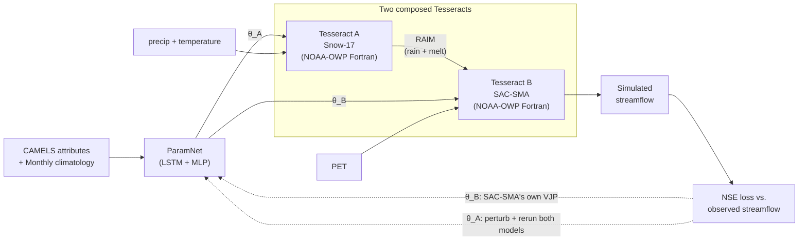

# 𝛿snow17-sacsma

*Built for the Pasteur Labs Tesseract Hackathon 2026 — Track 03: Hybrid
ML + mechanistic models.*

## The problem

NOAA's River Forecast Centers have run Snow-17 and SAC-SMA in
production since the 1970s — a snowmelt model and a soil-moisture
accounting model, hand-calibrated basin by basin by hydrologists, to
forecast streamflow across the country. That calibration process still
doesn't scale: NOAA maintains it for a few thousand forecast points,
and the vast majority of U.S. stream reaches have never been
individually calibrated at all.

The obvious fix already exists in the literature — train a neural
network across many basins at once so it learns what calibration *is*,
instead of hand-tuning one basin at a time, and it generalizes to
basins nobody calibrated. NeuralHydrology-style LSTMs already do this,
well. But they throw the physics away to do it: a black-box streamflow
number, with no melt factor or soil-moisture capacity behind it and no
conservation of mass to check, isn't something an operational
forecaster can audit the way they audit SAC-SMA's actual state
variables.

The differentiable-parameter-learning line of work wants both: keep
the physical model, let a neural network learn its parameters
end-to-end the way anything else gets trained by gradient descent. It
almost always gets there by rewriting the physics in JAX or PyTorch
first, because autograd needs a recorded graph and compiled Fortran
leaves none behind — meaning what gets learned describes a
reimplementation, not the model actually issuing NOAA's forecasts.

That's the wall this project runs into directly, and it's exactly the
shape of problem [Tesseract](https://github.com/pasteurlabs/tesseract)
exists to solve: wrap an existing solver - so it becomes a composable layer any training loop can pull
real gradients through. The actual Fortran NOAA runs,
unmodified, with a neural network learning to calibrate it.

## Architecture

Two composed Tesseract containers wrap Snow-17 and SAC-SMA end to end;
an LSTM+MLP learns both models' parameters directly from basin
attributes by backpropagating a streamflow loss through the coupled
Fortran physics:



Solid arrows are the forward pass. The two dashed arrows are gradients,
and they're deliberately not symmetric: θ_B's uses SAC-SMA's own
Tesseract VJP endpoint directly. θ_A's doesn't — Snow-17's parameters
only reach the loss through RAIM (~3,650 daily values), and no
Tesseract's VJP can differentiate a downstream container it doesn't
own, so θ_A's gradient instead perturbs each Snow-17 parameter and
reruns both models, reading how the final runoff moved. Snow-17
produces RAIM (rain-plus-melt) — the same coupling flux NOAA runs
operationally into SAC-SMA — so the container boundary sits at a real,
existing operational seam.

## Why Tesseract

PyTorch's `.backward()` walks a recorded graph — Snow-17 and SAC-SMA
are compiled Fortran, so nothing is recorded and autodiff stops cold.
Each model is wrapped as its own Tesseract exposing `apply()` and a
finite-difference `vector_jacobian_product()`; `tesseract-torch` splices
both into the autograd graph as ordinary differentiable layers. Two
Tesseracts are composed here: NOAA maintains Snow-17 and SAC-SMA as separate
modules, and a standalone Snow-17 Tesseract is reusable with any
downstream rainfall-runoff model, not just this one.

Both containers are built and gradient-checked end-to-end — against
autograd ground truth and an independent brute-force check on cheap
stand-ins first (`tests/test_coupling_toy.py`), then against the real
Tesseracts (`tests/test_pipeline_hhwm8.py`, `tests/test_gradients.py`).
`tesseract build` runs in CI on every push, building both containers
from scratch and smoke-testing `apply()` against the built images (see
[.github/workflows/ci.yml](.github/workflows/ci.yml)).

## Results

`ParamNet` predicts all 27 learnable parameters (11 Snow-17 + 16
SAC-SMA) from each basin's static CAMELS attributes plus a climatology
sequence, trained end-to-end across 35 snow-dominated CAMELS basins
with 10 held out (WY1991-1999, spatial holdout — prediction in
ungauged basins):

| | median train NSE | median held-out NSE |
|---|---|---|
| epoch 1 | +0.38 | +0.28 |
| epoch 150 (final) | **+0.84** | **+0.70** |

Held-out basins track training basins closely throughout (gap ~0.14) —
no overfitting observed at this scale. Full numbers and reproduction
commands: [results/README.md](results/README.md).

Checked honestly against a properly-engineered LSTM
([NeuralHydrology](https://github.com/neuralhydrology/neuralhydrology)),
trained and tested on the *exact same* 35/10 basin split:

| model | median held-out NSE |
|---|---|
| NeuralHydrology LSTM | **0.795** |
| this hybrid model | 0.70 |

Against a competent LSTM, this hybrid model currently trails on raw
NSE — see [results/external/neuralhydrology_lstm_pub/](results/external/neuralhydrology_lstm_pub/README.md).
That's not the claim this project is making, though: the point was
never "beat an LSTM," it was learning NOAA's *actual* operational
parameters end-to-end without rewriting the physics — see The problem,
above.

## Reproduce

Requires [uv](https://docs.astral.sh/uv/) and `gfortran`.

```bash
git submodule update --init --recursive   # vendors NOAA-OWP/snow17 + sac-sma, pinned commits
make test                                  # creates .venv, builds Fortran shims, runs pytest
```

Multi-basin training needs CAMELS data (~3.4GB, one-time, not fetched
by `make test`):

```bash
data/download_camels.sh
.venv/bin/python data/select_basins.py
.venv/bin/python data/build_attributes.py
.venv/bin/python data/build_pet.py
.venv/bin/python data/build_climatology.py

.venv/bin/python src/train.py                                  # trains the hybrid model (~13 min, CPU)
.venv/bin/python src/infer.py checkpoint=results/runs/model_9yrs_spatial/checkpoint.pt
```

Training/inference are driven by [Hydra](https://hydra.cc/) configs
under `configs/` (data / split / model / train) rather than hardcoded
constants — override anything from the CLI, e.g. `seed=1` or
`split.window.end=1993-09-30`. Everything runs on CPU; the
Fortran/Tesseract calls (finite-difference gradients) are the
bottleneck, not model size, so a GPU wouldn't help. See
[results/README.md](results/README.md) for saved runs and
`results/compare_runs.py` for comparing them.

**Docker note:** day-to-day `apply()`/`vector_jacobian_product()`
development runs through `tesseract_core.Tesseract.from_tesseract_api()`
directly (no container needed); actual `tesseract build` runs in CI,
where Docker is available.

## Layout

```
external/snow17/, external/sac-sma/   git submodules, pinned commits (Apache-2.0, unmodified)
patches/                              disclosed, minimal, build-time-only patch to vendored source
fortran/                              bind(C) shims threading each model's state explicitly
tesseracts/snow17/, tesseracts/sacsma/  the two Tesseract containers: apply() + finite-difference VJP
src/coupling.py                       cross-model gradient orchestration
src/pipeline.py                       wires the real Tesseracts into coupling.py
src/paramnet.py                       LSTM + MLP: attributes/climatology -> 27 bounded parameters
src/train.py, src/infer.py            Hydra-driven training / checkpoint scoring CLIs
configs/                              Hydra config groups (data/split/model/train)
data/                                 CAMELS download + basin selection + attribute/PET/climatology prep
tests/                                shim determinism/mass-balance, VJP checks, coupled-chain regression
notes/NOTES.md                        upstream Fortran findings, with a before/after proof
notes/logs.md                         design-decision rationale log
results/                              saved, seeded, reproducible run directories + external comparisons
```

## License

Apache-2.0. See [LICENSE](LICENSE) and [NOTICE](NOTICE). Snow-17 is
vendored and linked against **unmodified**. SAC-SMA is vendored
unmodified as a pinned submodule; one disclosed, minimal patch is
applied to a **build-time copy only** to fix a confirmed upstream
defect — `external/sac-sma` itself is never modified. "Original work"
applies to this submission, not its dependency tree: the shims,
patches, Tesseract wrappers, gradient endpoints, and training pipeline
are original work written during the hackathon period (Aug 3-31, 2026).
